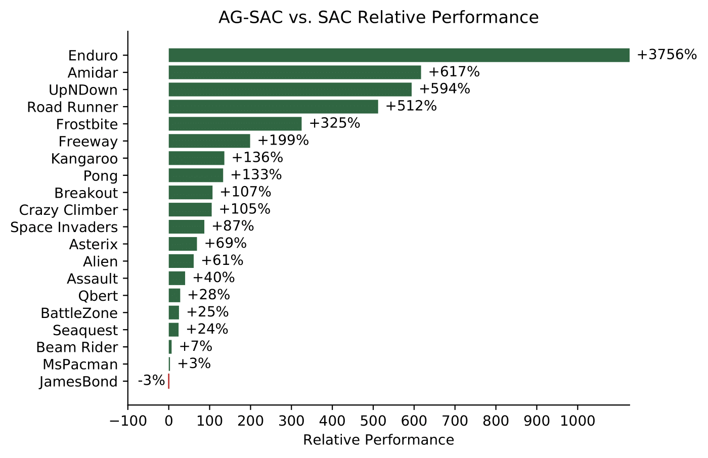

# Action Grammar Reinforcement Learning

Action Grammar Reinforcement Learning is a form of hierarchical RL that alternates between two steps:
 
* **Gather Experience**: the base RL agent plays episodes and stores its experiences 
* **Identify Action Grammar**: the actions used in the agent’s past experiences are used to identify the action grammar. The action grammar is then appended to the agent’s action set as macro-actions

Using AG-DDQN improved sample efficiency over DDQN in 8 out of 8 Atari games with a median improvement
of 31% and maximum of 668%. Using AG-SAC improved sample efficiency over SAC in 19 out of 20 Atari games with a median improvement
of 78% and maximum of 3756%:

   
    
We provide the code for two instantiations of AG-RL in this repository called AG-DDQN and AG-SAC.

### Replicating the Results

To replicate the results mentioned above follow these steps:

* Download and unzip the code file
* Install the requirements in the requirements.txt folder (e.g. by doing: pip install -r requirements.txt)
* For the AG-DDQN results follow the instructions and run the code in `results/AG_DDQN_Experiment.py`
* For the AG-SAC results run the code in `results/AG_SAC_Experiment.py`

### Code Structure

The repository's high-level structure is:
 
    ├── agents                    
        └── ag_rl_agents           
    ├── environments  
    ├── experiments   
        └── results         
    ├── tests
    └── utilities  
        ├── data_structures
        └── grammar_algorithms                 

Where the following things can be found:
* AG-RL: `agents/ag_rl_agents/AG_RL.py`
* AG-DDQN: AG-RL combined with `agents/ag_rl_agents/AG_DDQN_Wrapper.py`
* AG-SAC: AG-RL combined with `agents/ag_rl_agents/AG_SAC_Wrapper.py`
* Hindsight Action Replay technique: `utilities/Memory_Shaper.py`
* Abandon Ship technique: `agents/ag_rl_agents/AG_DDQN_Wrapper.py` or `agents/ag_rl_agents/AG_SAC_Wrapper.py`
* Action Balanced Replay Buffer: `utilities/data_structures_Action_Balanced_Replay_Buffer.py`
* IGGI: `utilities/grammar_algorithms/IGGI.py`
* k-Sequitur: `utilities/grammar_algorithms/k_Sequitur.py`
* The dissertation's report and presentation can be found in the folder `reports`

